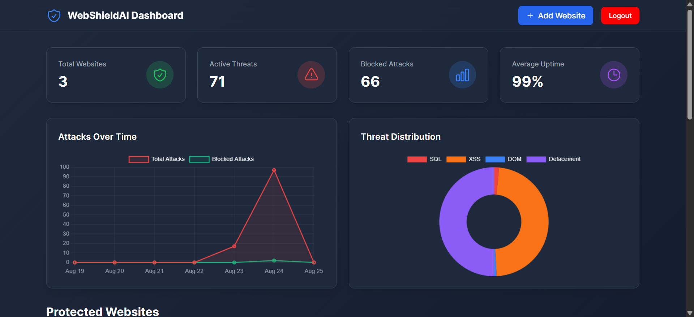
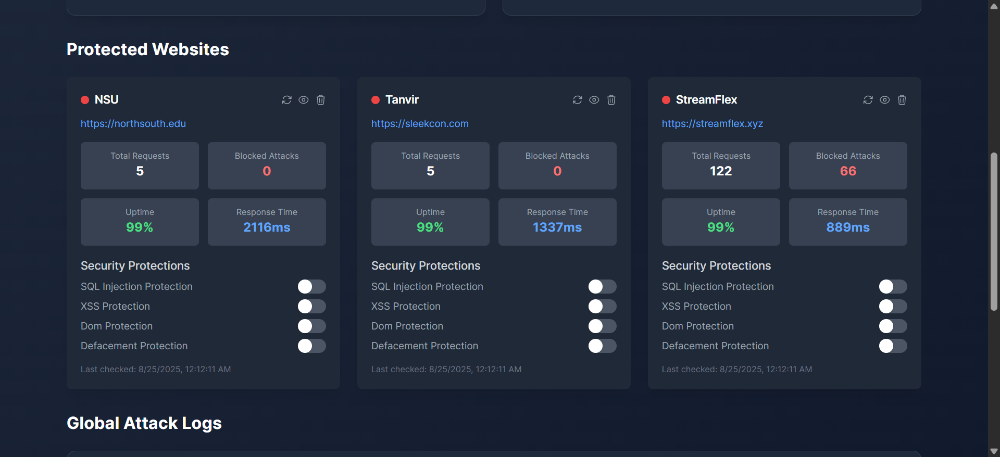
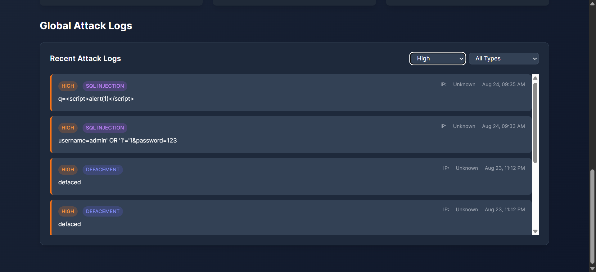
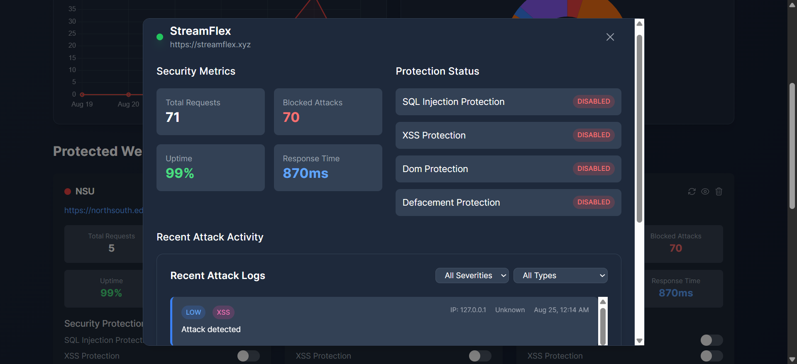
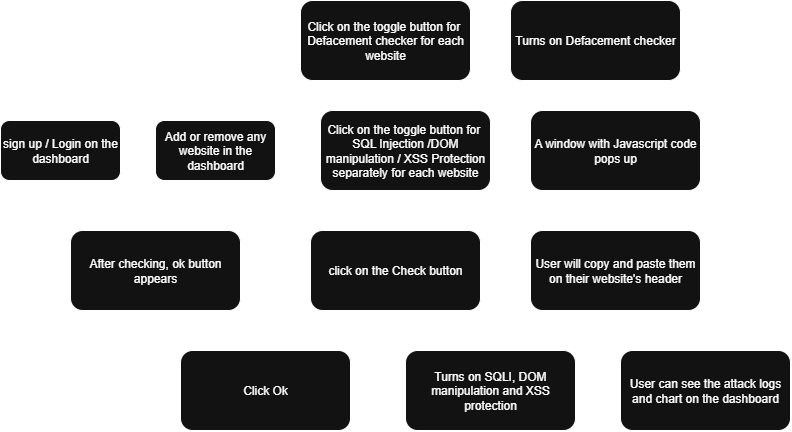

# WebShield AI  
**AI Powered Web Intrusion Detection and Auto-Defense SaaS Platform**

### Authors
- Md. Tanvir Chowdhury (2232122642)  
- Nurjahan Bint Hamid (2212396642)  
- Shahida Akter (2222446642)  

**Instructor:** Muhammad Shafayat Oshman  
**Course:** CSE 299: Junior Design, Section 10  

---

## 📌 Introduction
The rapid growth of the internet and web-based platforms has created unprecedented opportunities for businesses, governments, and individuals. However, this expansion has also brought a sharp increase in cyberattacks such as **SQL Injection (SQLi), Cross-Site Scripting (XSS), DOM manipulation, and website defacement**.  

Traditional security systems like firewalls and intrusion detection systems (IDS) often rely on **signature-based detection**, which is ineffective against evolving and zero-day threats.  

To address this issue, **WebShield AI** is designed as an **AI-powered website intrusion detection and auto-defense system**. Built as a **Software-as-a-Service (SaaS)** platform, it uses advanced **Machine Learning (ML) models** such as **LSTM for SQL injection detection** and **CNN for website defacement detection**.  

The project integrates:
- **Frontend Dashboard (Vue.js)**
- **Backend API (FastAPI + PostgreSQL)**
- **Lightweight JavaScript Agent** deployed on client websites  

It provides **real-time monitoring, threat visualizations, and AI integration**.

---

## 🚨 Problem Statement

### Social Problem
Cyberattacks compromise the safety of millions of internet users by stealing sensitive data, defacing websites, and spreading misinformation. For **small and medium-sized enterprises (SMEs)**, a single security breach can cause:
- Severe financial loss  
- Reputational damage  
- Customer distrust  

Since many SMEs cannot afford enterprise-grade security solutions, they are often left vulnerable.

### Technical Problem
Most traditional website security solutions:  
- Depend on **signature-based rules**, which fail against new/unknown attacks.  
- Lack **adaptive intelligence**, meaning they do not learn or evolve over time.  
- Provide **minimal usability**, requiring experts to manage.  
- Do not offer **centralized SaaS-based dashboards** with AI-driven insights.  

👉 Thus, there is a pressing need for an **affordable, intelligent, and automated intrusion detection and response system** that can be deployed easily and scale across industries.

---

## 🛡️ Project Description
**WebShield AI** is an **AI-driven website security platform**. Its goal is to detect modern cyberattacks in real time and notify the website owner.

### 🔑 Key Features

#### 1. SQL Injection Detection (LSTM Model)
- Trained on SQL queries to differentiate between **malicious and normal queries**.  
- Detects **hidden injection patterns** missed by other security systems.  
- Reports anomalies to the backend and **blocks execution if harmful**.  

#### 2. Website Defacement Detection (CNN Model)
- Uses **visual screenshots** of websites captured periodically.  
- CNN classifies whether the site’s appearance is **legitimate or tampered**.  

#### 3. DOM Mutation & XSS Detection
- A **lightweight JS agent** monitors DOM changes in real time.  
- Detects malicious `<script>`, `<iframe>`, event injections, etc.  
- Reports anomalies to the backend and **blocks execution if harmful**.  

#### 4. Dashboard (Vue.js Frontend)
- Centralized web portal for users.  
- Features:  
  - Add/manage websites  
  - Toggle protection modules (SQLi, Defacement, XSS, DOM manipulation)  
  - Attack visualizations (charts and logs)  
  - Real-time alerts via email notification  

#### 5. Backend (FastAPI + PostgreSQL)
- Handles authentication, user sessions, and attack logs.  
- Hosts ML detection APIs.  
- Manages **website-agent communication**.  

#### 6. Auto-Defense Mechanism
- If an attack is detected, the system can:  
  - Mitigate the attack by **redirecting to the Home page**  
  - **Log and notify** the admin in real-time  

📸 **Dashboard Screenshots:**  
  
  
  
  

---

## 📊 Project Flowchart

---

## 🛠️ Technologies Used
| **Layer**        | **Technologies** |
|------------------|------------------|
| Frontend         | Vue.js, TailwindCSS, Chart.js |
| Backend          | FastAPI, SQLAlchemy, Uvicorn |
| Database         | PostgreSQL |
| Machine Learning | TensorFlow/Keras (LSTM & CNN models), Scikit-learn |
| Security Agent   | Lightweight JavaScript snippet (Mutation Observer) |
| Version Control  | GitHub |

---

## 💰 Cost Analysis (Real World Implementation)
| **Component** | **Estimated Cost** |
|---------------|---------------------|
| Cloud Hosting (Render/Railway) | $19 – $30/month |
| GPU Training for ML Models (larger data) | $10 – $20/month |
| Storage for Attack Logs | $15/month |
| Domain + SSL | $130/year |
| Monitoring & Scaling Costs | $100 – $500 |

### Pricing Plans for SME Clients
- **Basic Plan:** $15/month (1 website)  
- **Professional Plan:** $50/month (up to 5 websites)  
- **Enterprise Plan:** $200/month (unlimited websites + premium support)  

👉 This makes **WebShield AI** financially feasible and scalable.

---

## ✅ Conclusion
WebShield AI addresses one of the most important challenges in modern web security: **intelligent, adaptive protection against evolving threats**.  

By leveraging ML models for **SQLi, defacement, DOM manipulation, and XSS detection**—and combining them with an **easy-to-use SaaS platform**—the system provides **affordable enterprise-grade protection** for SMEs and large organizations alike.  

This project demonstrates how **AI-driven defense mechanisms** can surpass traditional methods by learning different attack patterns.  

🚀 With future enhancements such as **federated learning, zero-trust integrations, and blockchain-based tamper-proof logs**, WebShield AI has the potential to **revolutionize website protection** and become a benchmark in intelligent cybersecurity systems.

---
